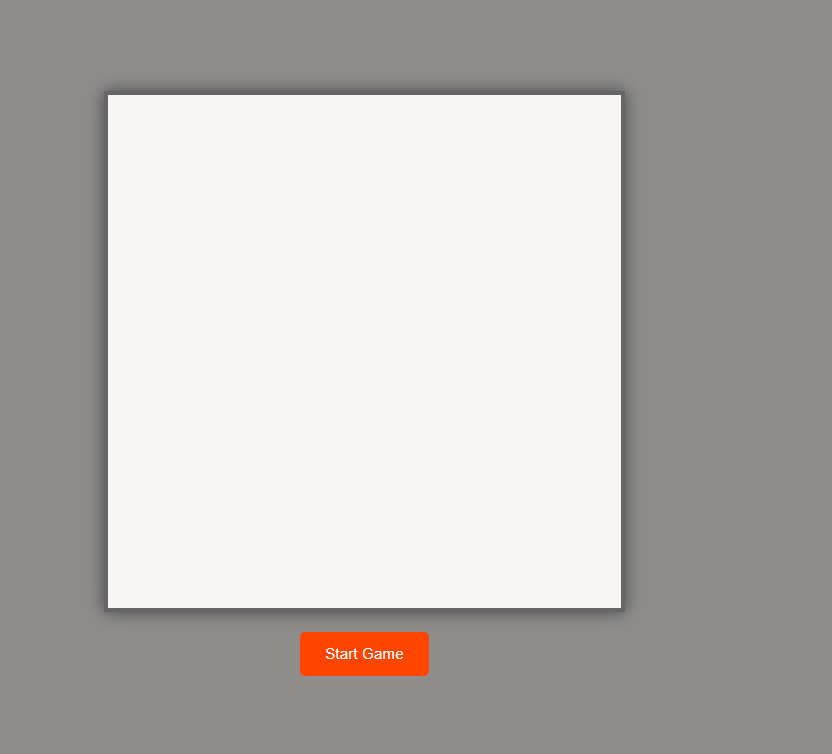
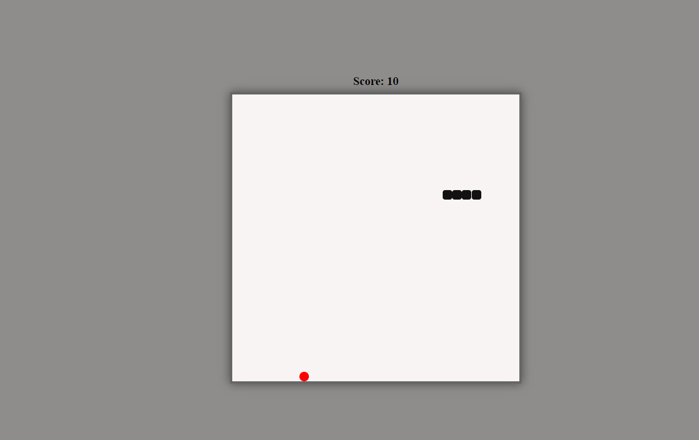
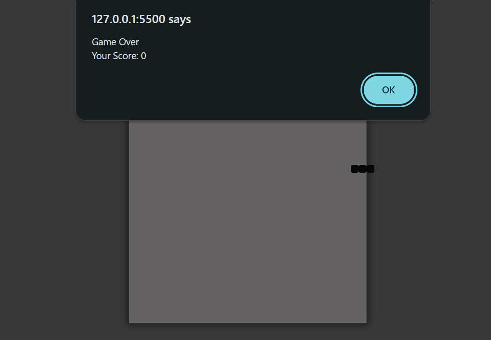

# Snake Game

A classic Snake Game built with HTML, CSS, and JavaScript.  
Control the snake, eat food to grow, and avoid running into yourself or the walls!

## Features

- Classic snake gameplay with keyboard controls
- Responsive design for desktop and mobile
- Score tracking
- Game over and restart functionality

## Tech Stack

- HTML
- CSS
- JavaScript

## How to Run

1. **Clone the repository:**
   ```bash
   git clone https://github.com/ypramod25/SnakeGame.git
   cd SnakeGame
   ```

2. **Open `index.html` in your browser.**

No build step or dependencies required.

## Controls

- **Arrow keys**: Move the snake (Up, Down, Left, Right)
- **Spacebar**: Restart the game (if implemented)

## Project Structure

```
SnakeGame/
  ├── index.html
  ├── index.css
  └── script.js
```

## Screenshots



